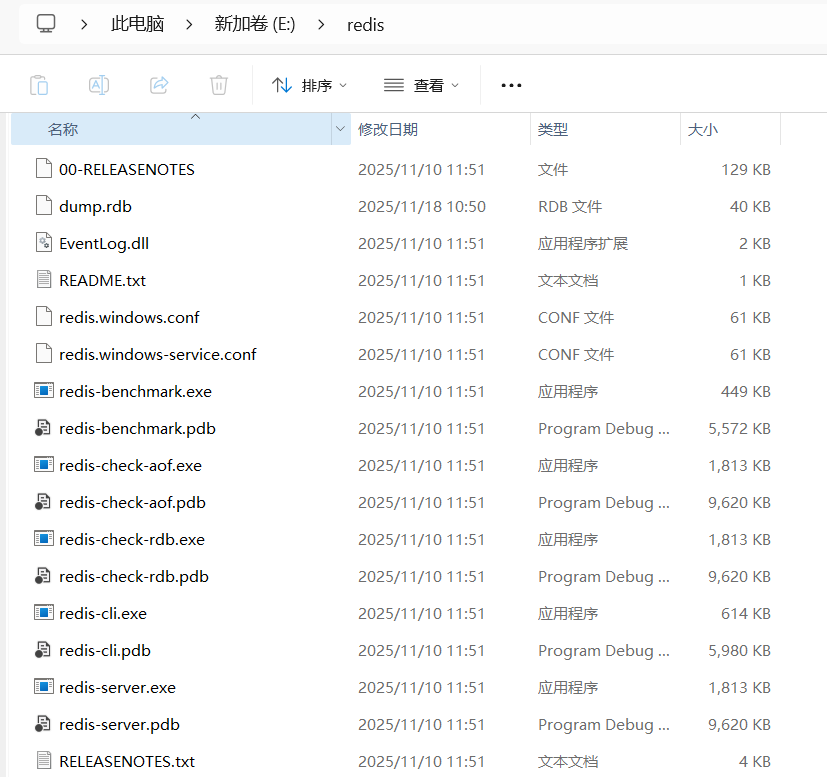
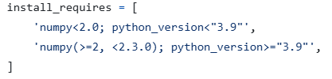
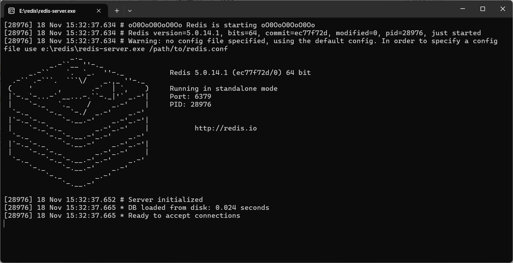

# 📘 视频转小红书笔记（video2xhsnote）

一个自动化处理视频并生成 **小红书风格图文笔记** 的开源工具。  
支持 **音频转文字、视频抽帧、视觉理解、AI 文案生成**、**AI 图片生成** 等功能，帮助创作者高效完成“视频 → 图文笔记”流程。

---

## ✨ 功能特点（Features）

- 🎧 **音频转文字**：基于 Whisper 高精度识别语音  
- 🖼️ **视频智能抽帧**：支持固定间隔帧抽帧  
- 🧠 **视觉描述生成**（ Qwen3-vl:2b）  
- 📝 **自动生成小红书笔记**（标题+正文+话题+图片）  
- 🔧 **支持 Celery 异步任务**，可批量处理多个视频  
- 🚀 模块化设计，易于扩展  

---


## 📁 项目结构（Project Structure）

```
video2xhsnote/
 |
 |------process_steps/
 |                   |------step1_extract_audio.py 				  # 提取视频中的音频
 |                   |------step2_audio2text.py					  # 音频转成文字信息
 |                   |------step3_vision_comprehension.py		  # 视频图像理解
 |                   |------step4_generate_note.py				  # 小红书笔记生成
 |
 |------config.py										 		  # 配置文件
 |
 |
 |------generate_pic.py      									  # 图片生成           				
 |
 |
 |------main.py										  			  # 主函数入口
 |
 |
 |------requirements.txt								 		  # 项目的依赖
```

___


## 🔨 用到的工具（需安装）

### FFmpeg([FFmpeg](https://ffmpeg.org/))

```
# 安装FFmpeg
# Mac：brew install ffmpeg
# windows: 从官网下载并且加入环境变量
# Linux: apt install ffmpeg

# 验证是否安装成功
ffmpeg -version
```

___

### Redis([Redis](https://github.com/tporadowski/redis/releases))

**大家如果没有安装或者不会安装，可以进入我给的地址，下载并且解压压缩包（windows），解压结果如下**



双击redis-server.exe即可开启redis服务

___

### Ollama([Ollama](https://ollama.com/))

```
# Ollama安装，直接从我给的链接进去download就行，选择自己合适的操作系统

# 检查是否成功
ollama --version

# ollama常用命令
ollama pull <model_name> 	# 拉取模型
ollama ls 					# 查看拉取过的模型
ollama rm <model_name> 		# 删除模型
ollama run <model_name>		# 运行模型
```


___

## 🗂️依赖安装

### 1、因为项目的不同包对于numpy的版本都有要求，这边建议python版本设为3.8

如下图是安装opencv时，python版本和numpy版本的约束



```
# 使用anaconda创建一个虚拟环境，指定python版本为3.8
conda create -n <虚拟环境名称> python=3.8
```


### 2、进入虚拟环境并且安装依赖

```
# 激活虚拟环境 
conda activate <虚拟环境名称>

# 安装依赖
pip install -r requirements.txt

# 为playwright安装需要的浏览器，我这里用到了谷歌浏览器
playwright install chromium

# 默认安装的是cpu版本的torch，如果你的电脑有显卡，可以安装GPU版本的torch
```

[torch安装地址](https://pytorch.org/get-started/previous-versions/)

选择合适的版本安装即可


### 3、项目的配置 （必须）

```python
# config.py
# 请根据你个人的配置需求，进行适当更改

# 输出的音频路径
audio_dir = './audio'
# 小红书笔记输出路径
output_dir = './notes'
# 视觉理解prompt
vision_prompt = """
    请分析并描述这张图片（来自视频的一帧）。请从以下维度进行说明：
    1. 画面中的主要主体与物体  
    2. 场景环境与背景信息  
    3. 人物或物体的动作、姿势或交互  
    4. 氛围、光线、色调  
    5. 可以推断的场景语义或可能发生的事件  
    请尽量客观、简洁、结构化地描述画面。
"""
# 视频抽帧间隔，数值越小，抽帧数量越多，处理时间越长
interval = 500
# 视觉理解模型（注意名称与ollama中一致，使用前先从ollama拉取模型）
vision_model = 'qwen3-vl:2b'
# 笔记生成模型（注意名称与ollama中一致，使用前先从ollama拉取模型）
generate_model = 'deepseek-r1:8b'
# 有显卡则为"cuda"，否则为"cpu"，mac用户为"mps"
device = 'cuda'
# 图片生成文件夹
img_dir = './image'

```


### 4、模型的拉取

```python
# 大家可以根据自己的实际情况，选择合适的模型进行拉取

# 拉取视觉理解模型
ollama pull qwen3-vl:2b

# 拉取小红书笔记生成模型
ollama pull deepseek-r1:8b
```


___


## 🚀开始项目

### 1、首先进入你的redis下载目录，运行redis-server.exe启动redis服务



如图即为启动成功

``````
关闭redis服务只需要在上图界面输入 ctrl+c
``````


___

### 2、启动分布式消息队列的异步任务调度框架celery

```
# 在终端输入如下命令以启动celery
# ！！！注意在项目路径下输入如下命令
celery -A main worker --loglevel=info --pool=gevent --concurrency=4

# 同样，关闭celery只需要在打开celery的终端输入 ctrl+c
```


___

### 3、开始处理

```
运行main.py，输入需要处理视频的路径，按照控制台的引导，结束输入'ok'，等待程序结束即可，最后生成的小红书笔记保存在config.py中你指定的output_dir目录中。
```


___

### 4、生成图片

```
生成图片需执行generate_pic.py，在控制台的指引下与它进行交互就行，最后生成的图片保存在config.py中你指定的img_dir目录中。
```

